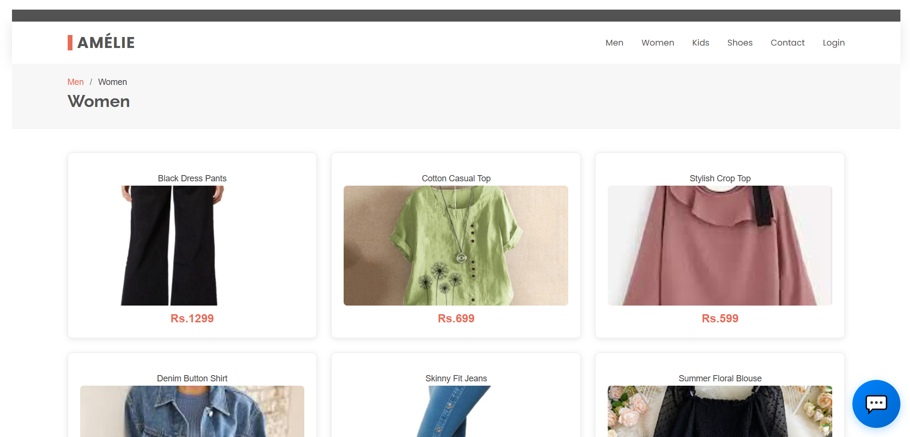
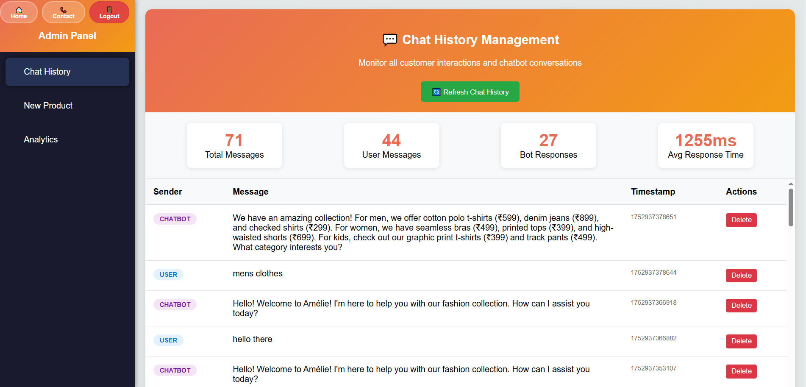
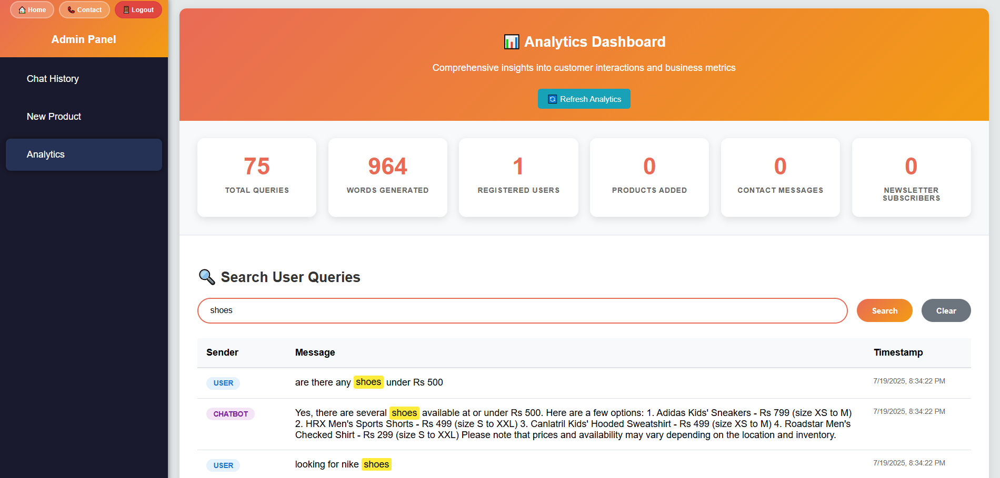
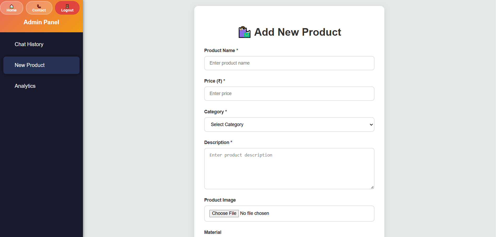

# Amélie Customer Service Chatbot

An AI-powered customer service chatbot for the Amélie fashion e-commerce platform. This application provides intelligent customer support, product management, and comprehensive analytics through a modern web interface.

## 🌐 Live Demo

**🔗 [View Live Application](https://customer-service-chatbot-246d6.web.app/)**

Access the live deployed version of Amélie's customer service chatbot platform. The application is hosted on Firebase Hosting with full functionality including:
- Smart AI chatbot with fallback system
- Complete product catalog and shopping experience
- Admin panel with real-time analytics
- Secure authentication and user management

## 📸 Screenshots

### Customer Interface

*Homepage with product showcase and navigation*


*Women's fashion collection with integrated chatbot*


*AI-powered chatbot providing customer support*

### Admin Dashboard

*Comprehensive admin dashboard with analytics*


*Real-time chat history and customer interaction analytics*


*Product CRUD operations and inventory management*

## Features

- 🤖 **Smart AI Chatbot**: Dual-mode system with Ollama AI and intelligent fallback responses
- 🔥 **Firebase Integration**: Real-time database, hosting, and secure authentication
- 👗 **Complete E-commerce**: Fashion store with product catalog, cart, and checkout
- 📊 **Admin Dashboard**: Comprehensive business management and analytics tools
- 🛒 **Shopping Experience**: Full e-commerce functionality with user authentication
- 📱 **Responsive Design**: Mobile-first, cross-device compatibility
- 🔐 **Secure Access**: Role-based authentication with admin panel protection
- 📈 **Real-time Analytics**: Customer interaction tracking and business insights
- 🎯 **Intelligent Fallback**: Chatbot continues working even when AI server is unavailable
- 🚀 **Production Ready**: Deployed on Firebase Hosting with optimized performance

## Quick Start

### Prerequisites

- Node.js (v14 or higher)
- Firebase account and project
- Ollama (for AI chatbot functionality)

### Installation

1. **Clone the repository**
   ```bash
   git clone https://github.com/MaheshR03/amelie-customer-service-chatbot.git
   cd amelie-customer-service-chatbot
   ```

2. **Install dependencies**
   ```bash
   npm install
   ```

3. **Firebase Setup**
   - Create a Firebase project at [Firebase Console](https://console.firebase.google.com/)
   - Enable Realtime Database
   - Get your Firebase configuration
   - Update the Firebase config in HTML files

4. **Ollama Setup (Optional - Fallback system works without it)**
   ```bash
   # Install Ollama from https://ollama.ai/
   ollama pull llama2
   ollama serve
   ```

5. **Start the development server**
   ```bash
   npm start
   ```

6. **Build and Deploy**
   ```bash
   npm run build
   npm run deploy:hosting
   ```

The application will be available at `http://localhost:8080` for development.

## 🛠️ Technology Stack

### Frontend
- **HTML5/CSS3**: Modern semantic markup and styling
- **JavaScript (ES6+)**: Client-side interactivity and API integration
- **Bootstrap**: Responsive UI framework
- **Firebase SDK**: Real-time database and authentication

### Backend & Services
- **Firebase Realtime Database**: NoSQL database for real-time data
- **Firebase Hosting**: Static web hosting with CDN
- **Ollama**: Local AI model hosting (optional)
- **Node.js**: Development tooling and build processes

### AI & Intelligence
- **Llama2 Model**: Self-hosted language model via Ollama
- **Pattern Matching**: Intelligent fallback chatbot system
- **Context Awareness**: Conversation state management

### Development Tools
- **NPM**: Package management and build scripts
- **ESLint**: Code quality and style checking
- **Git**: Version control and collaboration

## 📋 Configuration

### Firebase Configuration

The application uses Firebase for backend services. Update the Firebase configuration in your HTML files:

```javascript
var firebaseConfig = {
    apiKey: "your-api-key",
    authDomain: "your-project.firebaseapp.com",
    databaseURL: "https://your-project-default-rtdb.region.firebasedatabase.app",
    projectId: "your-project-id",
    storageBucket: "your-project.firebasestorage.app",
    messagingSenderId: "your-sender-id",
    appId: "your-app-id",
    measurementId: "your-measurement-id"
};
```

### Database Security Rules

Configure Firebase Realtime Database rules for secure access:

```json
{
  "rules": {
    ".read": false,
    ".write": false,
    
    "products": {
      ".read": true,
      ".write": "auth != null",
      "$productId": {
        ".validate": "newData.hasChildren(['name', 'price', 'category', 'description']) && newData.child('name').isString() && newData.child('price').isNumber() && newData.child('category').isString() && newData.child('description').isString()"
      }
    },
    
    "messages": {
      ".read": true,
      ".write": true,
      "$messageId": {
        ".validate": "newData.hasChildren(['timestamp', 'message', 'sender']) && newData.child('timestamp').isNumber() && newData.child('message').isString() && newData.child('sender').isString()"
      }
    },
    
    "chats": {
      ".read": "auth != null",
      ".write": "auth != null",
      "$chatId": {
        ".validate": "newData.hasChildren(['timestamp', 'message', 'sender']) && newData.child('timestamp').isNumber() && newData.child('message').isString() && newData.child('sender').isString()"
      }
    },
    
    "analytics": {
      ".read": "auth != null",
      ".write": "auth != null",
      "visits": {
        "$visitId": {
          ".validate": "newData.hasChildren(['timestamp', 'page']) && newData.child('timestamp').isNumber() && newData.child('page').isString()"
        }
      },
      "interactions": {
        "$interactionId": {
          ".validate": "newData.hasChildren(['timestamp', 'type', 'data']) && newData.child('timestamp').isNumber() && newData.child('type').isString()"
        }
      }
    },
    
    "contacts": {
      ".read": "auth != null",
      ".write": true,
      "$contactId": {
        ".validate": "newData.hasChildren(['name', 'email', 'message', 'timestamp']) && newData.child('name').isString() && newData.child('email').isString() && newData.child('message').isString() && newData.child('timestamp').isNumber()"
      }
    },
    
    "admin": {
      ".read": "auth != null",
      ".write": "auth != null"
    }
  }
}
```

### Admin Access

Default admin credentials for testing:
- **Email**: admin@amelie.com
- **Password**: Any password with 6+ characters

**Note**: In production, implement proper admin authentication with secure credentials.

## 🚀 Development

### Available Scripts

- `npm start`: Start the development server (Port 8080)
- `npm run admin`: Start admin panel server (Port 8081)
- `npm run build`: Build for production
- `npm run deploy:hosting`: Deploy to Firebase Hosting
- `npm run lint`: Run code quality checks
- `npm run format`: Format code with Prettier

### Project Structure

```
customer-service-chatbot/
├── assets/
│   ├── css/
│   │   └── style.css           # Main stylesheet
│   ├── js/
│   │   └── main.js             # Core JavaScript
│   ├── img/                    # Images and icons
│   └── vendor/                 # Third-party libraries
├── screenshots/                # Application screenshots
├── admin.html                  # Admin dashboard
├── index.html                  # Homepage (Men's section)
├── Women.html                  # Women's collection
├── Kids.html                   # Kids' collection
├── contact.html                # Contact page
├── package.json                # NPM configuration
├── firebase.json               # Firebase hosting config
├── database.rules.json         # Database security rules
├── .gitignore                  # Git ignore rules
└── README.md                   # Project documentation
```

## ✨ Key Features

### 🛍️ Customer Experience

- **Product Catalog**: Comprehensive fashion collections for Men, Women, and Kids
- **Smart Shopping Cart**: Add/remove items with size and color selection
- **Intelligent Chatbot**: AI-powered support with natural language processing
- **Voice Input**: Speech-to-text functionality for hands-free interaction
- **Responsive Design**: Optimized for desktop, tablet, and mobile devices
- **User Authentication**: Secure login/signup with role-based access

### 🤖 AI Chatbot System

- **Dual-Mode Operation**: Primary AI (Ollama) with intelligent fallback system
- **Context Awareness**: Maintains conversation history and product context
- **Pattern Recognition**: Smart responses for greetings, product inquiries, and support
- **Category Intelligence**: Specialized responses for different product categories
- **Graceful Degradation**: Continues working even when AI server is unavailable
- **Real-time Responses**: Instant feedback and streaming AI responses

### 👨‍💼 Admin Dashboard

- **Chat Analytics**: Real-time customer interaction monitoring
- **Product Management**: Full CRUD operations for inventory management
- **User Analytics**: Customer behavior tracking and insights
- **Sales Metrics**: Revenue tracking and performance analytics
- **Security Features**: Protected admin access with authentication
- **Real-time Updates**: Live synchronization with customer interactions

### 🔒 Security & Performance

- **Firebase Security Rules**: Granular access control for data protection
- **Authentication System**: Secure user management with JWT tokens
- **Rate Limiting**: Protection against abuse and spam
- **Input Validation**: Comprehensive data sanitization
- **HTTPS Enforcement**: Secure communication protocols
- **Performance Optimization**: Minified assets and CDN delivery

## 🚀 Deployment

### Production Deployment

The application is deployed on Firebase Hosting with the following setup:

```bash
# Build for production
npm run build

# Deploy to Firebase Hosting
npm run deploy:hosting
```

**Live URL**: [https://customer-service-chatbot-246d6.web.app/](https://customer-service-chatbot-246d6.web.app/)

### Deployment Features

- **Firebase Hosting**: Global CDN with automatic SSL
- **Performance Optimization**: Gzipped assets and caching headers
- **Custom Domain Support**: Easy domain configuration
- **Automatic Builds**: CI/CD integration capabilities
- **Rollback Support**: Easy version management and rollbacks

### Production Configuration

1. **Database Rules**: Configured for production security
2. **Authentication**: Admin access with secure credentials
3. **Performance**: Optimized asset delivery and caching
4. **Monitoring**: Firebase Analytics integration
5. **Error Handling**: Comprehensive error tracking and fallback systems

### Alternative Hosting Options

- **Netlify**: Static site hosting with continuous deployment
- **Vercel**: Serverless deployment with edge optimization
- **GitHub Pages**: Free hosting for static sites
- **Traditional Hosting**: Any provider supporting static file hosting

## 🔐 Security

### Implementation

- **Firebase Security Rules**: Granular database access control
- **User Authentication**: Secure login with role-based permissions
- **Input Validation**: Comprehensive data sanitization and validation
- **Rate Limiting**: Protection against API abuse and spam
- **HTTPS Enforcement**: Secure communication protocols
- **Admin Protection**: Secure admin panel with authentication

### Best Practices

- Sensitive configuration stored securely in Firebase
- No credentials committed to version control
- Regular security updates and dependency monitoring
- Proper error handling without information leakage
- Secure session management and token handling

## 📊 Analytics & Monitoring

### Built-in Analytics

- **Customer Interactions**: Real-time chat analytics and engagement metrics
- **Product Performance**: Track popular items and conversion rates
- **User Behavior**: Navigation patterns and feature usage
- **System Performance**: Response times and error rates

### Monitoring Tools

- **Firebase Analytics**: Integrated user behavior tracking
- **Error Tracking**: Comprehensive error logging and reporting
- **Performance Monitoring**: Load times and system health
- **Real-time Dashboards**: Live admin analytics and insights

## 🤝 Contributing

We welcome contributions to improve the Amélie Customer Service Chatbot! Here's how you can help:

### Getting Started

1. **Fork the repository**
2. **Create a feature branch**
   ```bash
   git checkout -b feature/your-feature-name
   ```
3. **Make your changes**
4. **Test thoroughly**
5. **Submit a pull request**

### Development Guidelines

- Follow existing code style and conventions
- Write clear commit messages
- Include tests for new features
- Update documentation as needed
- Ensure responsive design compatibility

### Areas for Contribution

- 🤖 AI chatbot improvements and new features
- 🎨 UI/UX enhancements and accessibility
- 🔒 Security improvements and best practices
- 📱 Mobile experience optimization
- 📊 Analytics and reporting features
- 🌐 Internationalization and localization

## 📞 Support & Contact

### Getting Help

- **Issues**: Create an issue on GitHub for bugs or feature requests
- **Documentation**: Check this README and inline code comments
- **Community**: Join discussions in GitHub Discussions
- **Email**: Contact the development team for urgent matters

### Reporting Issues

When reporting issues, please include:
- Detailed description of the problem
- Steps to reproduce the issue
- Browser and device information
- Screenshots or error messages (if applicable)

## 📄 License

This project is licensed under the MIT License - see the [LICENSE](LICENSE) file for details.

### Third-Party Licenses

- Bootstrap: MIT License
- Firebase: Firebase Terms of Service
- Ollama: Apache License 2.0
- Various other dependencies as listed in package.json

## 📈 Changelog

### Version 2.0.0 (Current - July 2025)
- ✅ **Smart Fallback System**: Intelligent chatbot responses when AI is unavailable
- ✅ **Firebase Hosting**: Production deployment with global CDN
- ✅ **Enhanced Security**: Improved database rules and admin authentication
- ✅ **Performance Optimization**: Minified assets and caching headers
- ✅ **Responsive Design**: Mobile-first UI improvements
- ✅ **Voice Input**: Speech-to-text functionality for chatbot
- ✅ **Real-time Analytics**: Enhanced admin dashboard with live metrics
- ✅ **Product Management**: Full CRUD operations with image upload
- ✅ **Error Handling**: Comprehensive error management and recovery

### Version 1.0.0 (Initial Release)
- 🚀 Initial release with core functionality
- 🤖 Basic AI chatbot with Ollama integration
- 🔥 Firebase Realtime Database integration
- 👗 E-commerce product catalog
- 📊 Admin dashboard with basic analytics
- 🔐 User authentication system
- 📱 Responsive web design

### Upcoming Features (Roadmap)
- 🛒 Enhanced shopping cart with persistent storage
- 💳 Payment gateway integration
- 📧 Email notifications and order confirmations
- 🔍 Advanced search and filtering
- 🌐 Multi-language support
- 📱 Mobile app development
- 🤖 Advanced AI features and personalization

---

## 👥 Team Information

### Team HAL04
*Innovating AI-Driven Bots for Tailored Customer Service and Effective Sales Engagement*

### Core Technologies
- **AI/ML**: Self-hosted Llama2 LLM via Ollama
- **Backend**: Firebase Realtime Database & Hosting
- **Frontend**: HTML5, CSS3, JavaScript (ES6+)
- **Framework**: Bootstrap for responsive design
- **Development**: Node.js tooling and NPM scripts

### Project Vision
We leverage the power of advanced language models to create effective sales and customer service experiences. Our dual-mode chatbot system ensures reliable service even when AI servers are unavailable, making it production-ready for real business environments.

### Key Achievements
- 🏆 Successfully deployed production-ready e-commerce platform
- 🤖 Implemented intelligent AI chatbot with graceful fallback
- 📊 Built comprehensive admin analytics dashboard
- 🔒 Established secure authentication and authorization
- 🚀 Achieved optimal performance with Firebase hosting
- 📱 Created responsive, mobile-first user experience

---

**🌟 Ready to revolutionize your customer service with AI? [Try the live demo now!](https://customer-service-chatbot-246d6.web.app/)**
